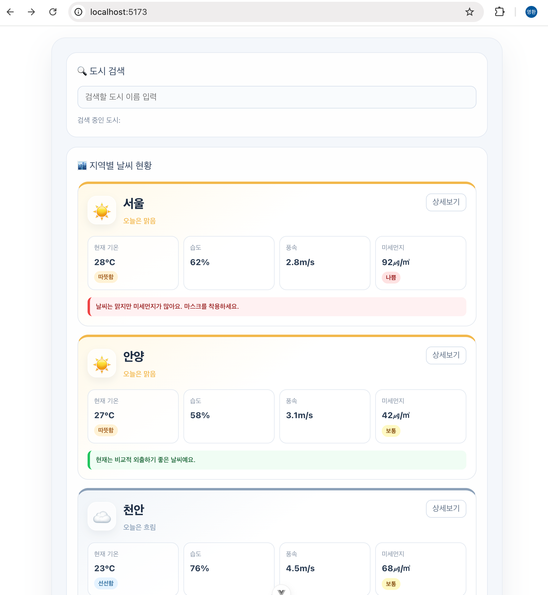
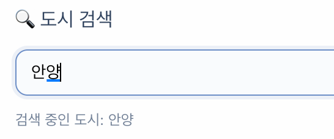
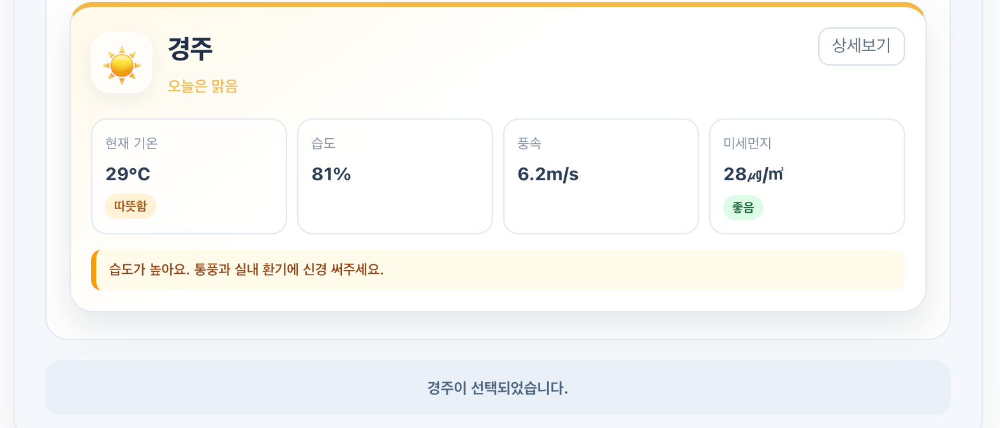
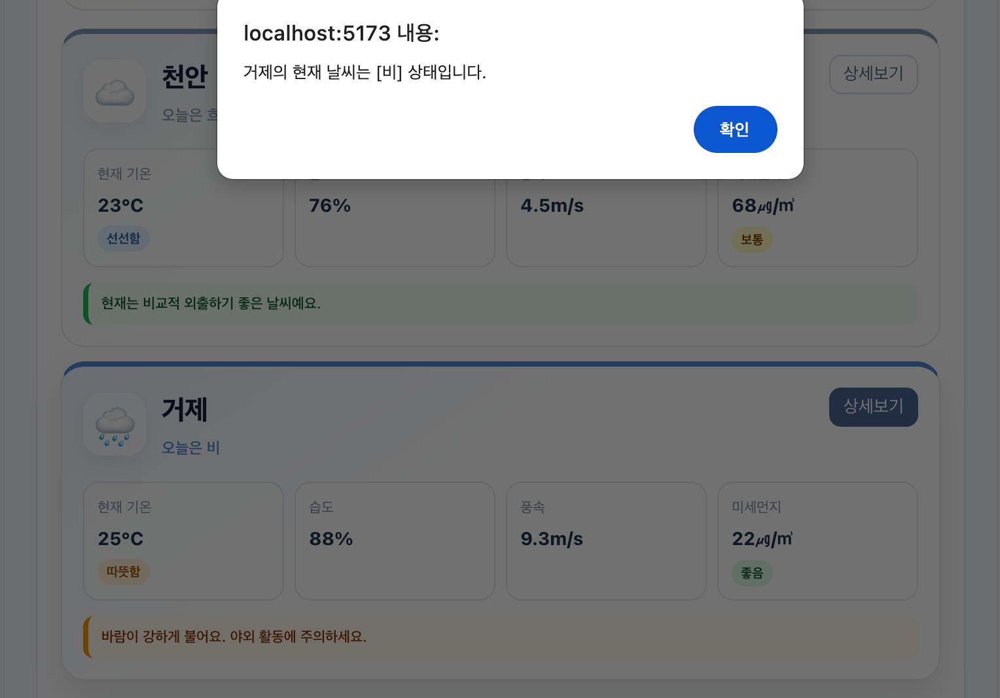

# Hands-on 1 - MockUp

날씨 데이터를 카드 형태로 보여주면서 Vue의 기본 문법을 한 화면에 적용해 본 실습입니다.

## 기본 요구사항

### 배열 데이터 반복 출력

요구사항은 배열에 담긴 날씨 데이터를 같은 카드 형태로 반복 출력하는 것이었습니다. 도시별 정보를 weatherList에 넣고 v-for로 카드를 만들었습니다. 각 도시의 id는 :key에 연결했습니다.

처음에는 반복문이 HTML을 여러 번 만드는 기능이라고만 생각했습니다. 직접 도시를 추가해 보니 배열에 데이터만 넣어도 같은 형태의 카드가 늘어나는 구조라는 점을 확인할 수 있었습니다.

### 조건에 따라 내용 구분

기온이 25도 이상이면 따뜻함, 25도 미만이면 선선함이 표시되도록 v-if와 v-else를 사용했습니다. 날씨 아이콘과 미세먼지 등급은 조건이 세 가지 이상이라서 v-else-if도 함께 사용했습니다.

조건을 여러 개 작성할 때는 위에서 먼저 만족한 내용 하나만 표시되기 때문에 조건의 순서도 같이 확인했습니다.

### 한글 검색어 반영

검색창의 값은 searchQuery와 연결했습니다. 한글은 글자가 조합되는 과정이 있어서 v-model을 사용했을 때 입력 중인 값이 한 박자 늦게 보였습니다. 그래서 :value와 @input으로 나누고, 입력 이벤트에서 받은 e.target.value를 searchQuery에 넣었습니다.

현재 검색어는 보간법으로 검색창 아래에 바로 표시했습니다.

### 카드와 버튼의 클릭 처리

카드를 클릭하면 선택한 도시가 하단 상태바에 표시되도록 @click을 사용했습니다. 상세보기 버튼은 showDetail 함수를 호출해 도시명과 날씨를 알림창으로 보여줍니다.

상세보기 버튼을 눌렀을 때 카드 선택까지 같이 실행되지 않도록 버튼에는 @click.stop을 사용했습니다.

## 구현 화면

### 전체 화면

5개 도시를 같은 카드 구조로 출력하고 날씨에 따라 아이콘과 강조 색상을 다르게 적용했습니다.

### 검색어 입력

한글 입력 중인 값이 검색창 아래에 바로 반영되는지 확인했습니다.

### 카드 선택

카드를 선택하면 해당 도시명이 화면 하단의 상태바에 표시됩니다.

### 상세보기

상세보기 버튼을 누르면 카드 선택 이벤트는 실행되지 않고 알림창만 나타납니다.

## 추가 사항

### 날씨 데이터 추가

기본 데이터에 습도, 풍속, 미세먼지를 추가하고 도시도 5개로 늘려봤습니다. 이번에 배운 v-for를 사용했기 때문에 카드 코드를 복사하지 않고 배열의 데이터만 추가할 수 있었습니다.

### 생활 안내 추가

기온을 나눌 때 사용한 v-if를 미세먼지, 풍속, 습도를 판단하는 데도 사용해 봤습니다. 미세먼지가 높으면 마스크 안내, 바람이 강하면 야외 활동 주의, 습도가 높으면 환기 안내가 나오도록 했습니다.

여러 안내를 한 번에 보여주기보다 중요한 내용 하나가 먼저 보이는 편이 낫다고 생각했습니다. 미세먼지, 강풍, 습도 순서로 조건을 배치하고 아무 조건에도 해당하지 않을 때만 기본 안내를 표시했습니다.

### 날씨 중심 카드로 변경

처음 제공된 화면은 온도 표시가 중심이었습니다. 카드에서는 도시명과 현재 날씨가 먼저 보이도록 바꾸고, :class를 사용해 맑음과 흐림, 비 상태에 맞는 색상을 적용했습니다.

스타일은 scoped 범위로 작성했습니다. 기온, 습도, 풍속, 미세먼지는 같은 크기의 영역에 놓아 현재 상태를 한 번에 비교할 수 있게 구성했습니다.

## 문제 해결

### 한글 입력이 늦게 보이는 문제

처음에는 검색창에 v-model을 사용했습니다. 한글은 자음과 모음이 조합된 뒤 값이 확정되기 때문에 입력 중인 글자가 바로 반영되지 않았습니다. :value와 @input으로 나눠 작성하고 e.target.value를 직접 반영하는 방식으로 바꿨습니다.

### 상세보기와 카드 선택이 같이 실행되는 문제

상세보기 버튼이 카드 안에 있어서 버튼을 누르면 카드의 클릭 이벤트도 같이 실행됐습니다. 클릭 이벤트가 부모 요소로 올라가는 버블링 때문이었습니다. 버튼에 .stop을 붙여 두 동작을 분리했습니다.

### 안내 조건이 하나만 보이는 문제

한 도시에 높은 습도와 강한 바람 조건이 같이 있어도 안내 문구는 하나만 표시됐습니다. v-if와 v-else-if가 위에서 처음 만족한 조건 하나만 렌더링하기 때문이었습니다.

여러 문구를 모두 띄우기보다 안내의 우선순위를 정하는 방식으로 사용했습니다.

## 정리

처음에는 v-for와 v-if, 바인딩과 이벤트를 각각 따로 외우려고 했습니다. 이번 화면을 만들면서 배열의 데이터가 조건을 거쳐 화면에 표시되고, 사용자의 클릭과 입력이 다시 데이터를 바꾸는 하나의 흐름이라는 점을 확인했습니다.

추가 기능도 새로운 문법을 더 사용하기보다 이번에 배운 문법을 다른 데이터에 적용하는 방식으로 만들어봤습니다.
