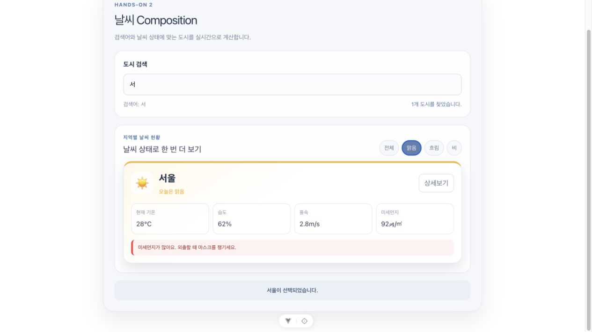

# Hands-on 2 - Composition

첫 번째 실습에서 만든 날씨 화면에 computed, watch, watchEffect를 적용해 본 실습입니다. 검색어가 바뀔 때마다 직접 목록을 수정하지 않고 Vue가 계산한 결과를 화면에 표시하도록 바꿨습니다.

## 기본 요구사항

### 반응형 상태 관리

검색어는 searchQuery, 선택한 도시 문구는 selectedCityInfo, 도시별 날씨 배열은 weatherList로 선언했습니다. 세 값 모두 화면에서 변경 내용을 확인해야 해서 ref로 관리했습니다.

스크립트에서는 값을 확인할 때 value가 필요하고, 템플릿에서는 Vue가 자동으로 값을 꺼내준다는 점도 다시 확인했습니다.

### 검색 결과 계산

검색 결과는 filteredWeatherList라는 computed로 만들었습니다. searchQuery의 앞뒤 공백을 제거한 뒤 도시 이름에 검색어가 포함되는지 확인했습니다.

검색어가 비어 있으면 모든 도시가 표시되고, 검색어가 있으면 조건에 맞는 도시만 남습니다. 검색어가 바뀔 때마다 별도의 함수를 호출하지 않아도 computed가 다시 계산됩니다.

### 선택한 도시 감시

카드를 누르면 selectedCityInfo의 문구가 바뀝니다. 이 값을 watch로 감시하고 이전 문구와 현재 문구를 개발자도구 콘솔에서 확인했습니다.

watch는 감시할 대상을 직접 정할 수 있고 변경 전후의 값을 받을 수 있어서 선택 문구가 바뀌는 과정을 확인하기에 적합했습니다.

### 검색어 자동 감시

searchQuery는 watchEffect 안에서 사용했습니다. 검색어를 따로 감시 대상으로 작성하지 않아도 함수 안에서 사용한 값을 Vue가 찾아서 추적했습니다.

watchEffect는 처음 등록될 때 한 번 실행되고, 이후 검색어가 바뀔 때마다 다시 실행됐습니다. 입력할 때마다 현재 검색어가 콘솔에 출력되는 것으로 동작을 확인했습니다.

### 검색 결과에 따른 화면 처리

검색어가 비어 있을 때는 전체 도시를 표시하고, 일치하는 도시가 있으면 해당 카드만 표시했습니다. 검색어와 날씨 조건을 모두 만족하는 도시가 없을 때는 빈 카드 영역 대신 검색 결과가 없다는 안내를 보여줍니다.

## 구현 화면

### 검색어와 날씨 필터 적용

검색어로 서울을 찾은 뒤 맑음 필터를 함께 적용했습니다. 두 조건을 모두 만족하는 카드 한 개와 검색 결과 개수가 표시됩니다.

### 검색 결과 없음

검색어와 날씨 상태가 서로 맞지 않을 때 결과 없음 안내가 표시되는지 확인했습니다.

## 추가 사항

### 날씨 상태 필터

검색어만 사용하는 것보다 날씨 상태도 함께 선택해 보고 싶어서 selectedWeather를 추가했습니다. 전체, 맑음, 흐림, 비 버튼 중 하나를 선택하면 검색어와 날씨 상태를 모두 만족하는 도시만 남습니다.

검색어 필터와 날씨 필터는 같은 filteredWeatherList에서 계산했습니다. computed가 여러 반응형 값을 함께 사용할 수 있다는 점을 적용해 본 부분입니다.

### 검색 결과 개수

현재 조건에 맞는 도시가 몇 개인지 보여주는 searchResultText를 computed로 추가했습니다. 아무 조건이 없을 때는 전체 도시 개수를 보여주고, 검색 중에는 찾은 도시 개수나 결과 없음 문구를 표시합니다.

### 필터 변경 감시

추가한 selectedWeather도 watch로 감시했습니다. 날씨 버튼을 누를 때 이전 필터와 현재 필터가 콘솔에 출력되도록 해서 직접 추가한 반응형 상태도 같은 방식으로 확인했습니다.

## 문제 해결

### watchEffect가 입력 전에도 실행되는 문제

처음에는 검색어를 입력하지 않았는데도 watchEffect 로그가 한 번 출력돼서 예상과 다르다고 생각했습니다. watchEffect는 함수 안에서 어떤 값을 사용하는지 확인하기 위해 등록 직후 한 번 실행된다는 점을 확인했습니다.

### 검색 조건이 겹치면 카드가 모두 사라지는 문제

검색어에는 맞지만 선택한 날씨 상태에는 맞지 않는 경우 카드가 하나도 남지 않았습니다. 동작 자체는 맞지만 빈 화면만 보여서 오류처럼 보였습니다. filteredWeatherList의 길이가 0일 때 별도의 안내 영역을 표시하도록 처리했습니다.

### 큰 화면에서 앱이 절반 너비로 보이는 문제

Vue 프로젝트에 기본으로 들어 있던 main.css가 큰 화면에서 app 영역을 2열 그리드로 만들고 있었습니다. 날씨 화면에는 필요하지 않은 설정이라서 기본 그리드와 링크 스타일을 제거하고 app이 전체 너비를 사용하도록 정리했습니다.

## 정리

computed는 기존 데이터를 이용해 화면에 필요한 값을 만드는 역할이고, watch와 watchEffect는 값이 바뀌었을 때 다른 작업을 실행하는 역할이라는 차이를 화면과 콘솔에서 확인했습니다.

특히 검색 결과를 직접 저장하고 계속 수정하는 대신 원본 데이터와 검색 조건만 두고 결과를 computed로 계산하는 방식이 더 단순하게 느껴졌습니다.
