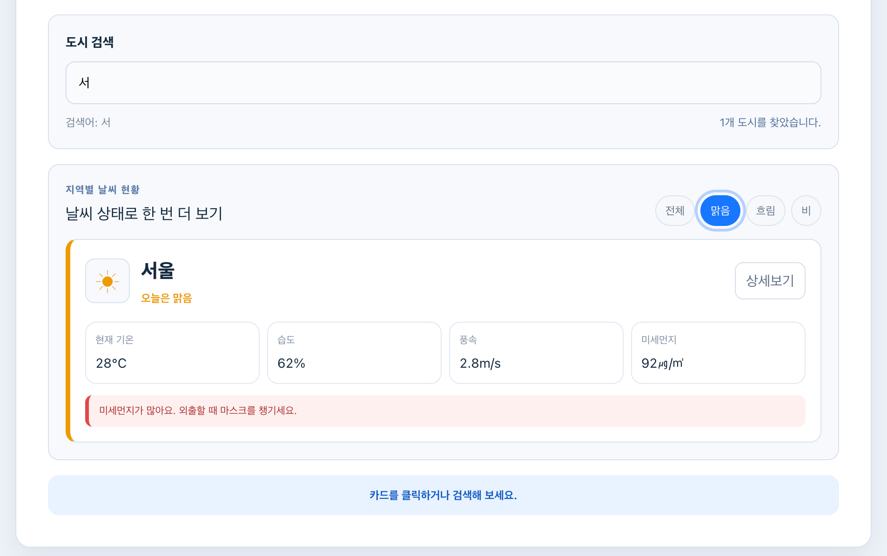
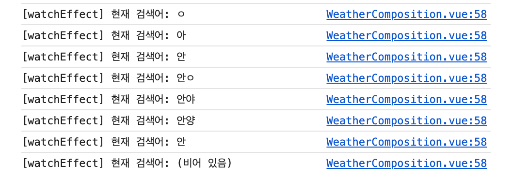

# Hands-on 2 - Composition

## 기본 요구사항

### 1. 반응형 상태 관리

`ref`를 배우고 검색어 `searchQuery`, 선택 문구 `selectedCityInfo`, 날씨 배열 `weatherList`를 반응형 상태로 선언했습니다. 값이 변경되면 화면에도 바로 반영되도록 했습니다.

### 2. 검색 도시 (`computed` 활용)

`computed`를 적용해 전체 날씨 목록에서 검색어가 도시 이름에 포함된 항목만 계산했습니다. 계산 결과는 `filteredWeatherList`에 담아 화면에 출력했습니다.

### 3. 반응형 변수 변화 감시 (`watch`, `watchEffect`)

`watch`로 `selectedCityInfo`의 이전 값과 변경된 값을 확인했습니다. `watchEffect`에서는 함수 안에서 사용한 `searchQuery`를 자동으로 추적해 검색어가 바뀔 때마다 콘솔에 출력했습니다.

### 4. 검색 결과 표시

검색어가 비어 있으면 전체 도시를 표시하고, 일치하는 도시가 있으면 해당 카드만 표시했습니다. 조건에 맞는 도시가 없으면 검색 결과가 없다는 안내를 보여주도록 했습니다.

### 5. 반응형 상태, Computed, Watcher 추가

날씨 상태를 저장하는 `selectedWeather`, 검색 결과 문구를 계산하는 `searchResultText`, 필터 변경을 감시하는 `watch`를 추가했습니다.

## 구현 화면

### 검색어와 날씨 필터 적용 화면

검색어와 선택한 날씨 상태를 모두 만족하는 도시만 표시되는 화면입니다.

### 검색 결과 없음 화면

검색어와 날씨 조건에 맞는 도시가 없을 때 안내 문구가 표시되는 화면입니다.

### `watchEffect` 실행 화면

검색어 변경을 감시해 `watchEffect`의 실행 결과가 콘솔에 출력되는 화면입니다.

## 개인 추가 사항

### 1. 날씨 상태 필터

검색어만으로 찾는 것보다 조건을 세분화하기 위해 `selectedWeather`를 추가하고 `computed`에서 검색어와 날씨 상태를 함께 확인했습니다.

### 2. 검색 결과 개수

현재 조건에 맞는 도시가 몇 개인지 바로 알 수 있도록 `searchResultText`를 `computed`로 만들었습니다.

### 3. 필터 변경 감시

직접 추가한 반응형 상태의 변화를 확인하기 위해 `selectedWeather`를 `watch`로 감시하고 변경 전후 값을 콘솔에 출력했습니다.
