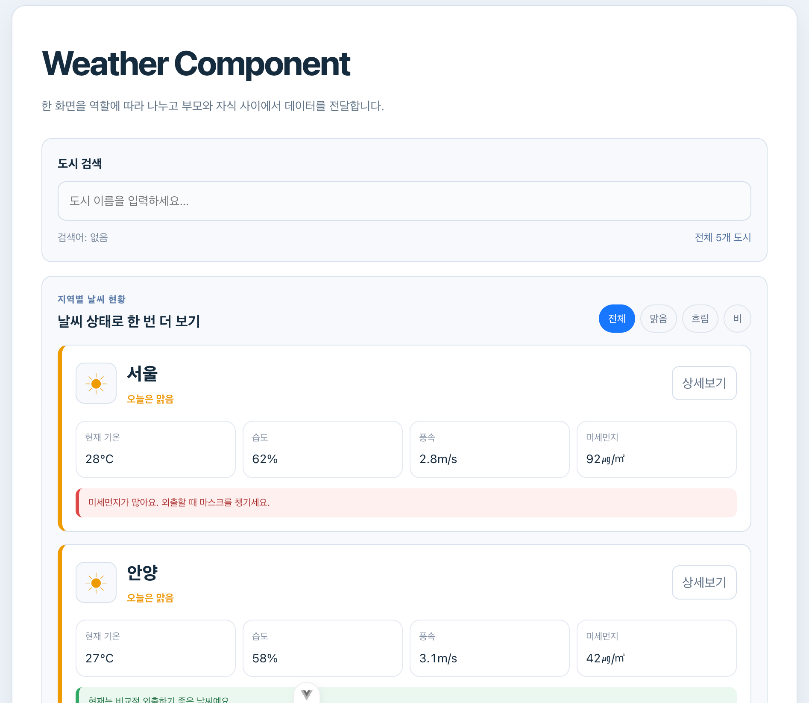
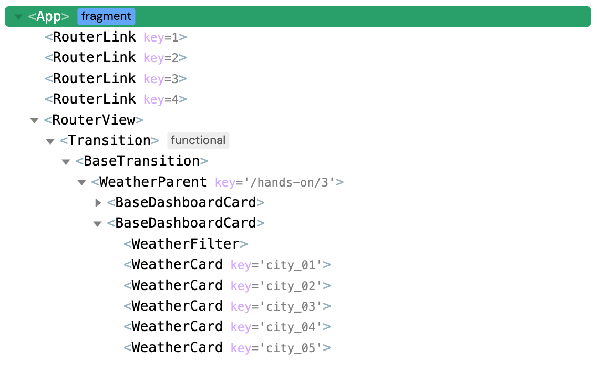
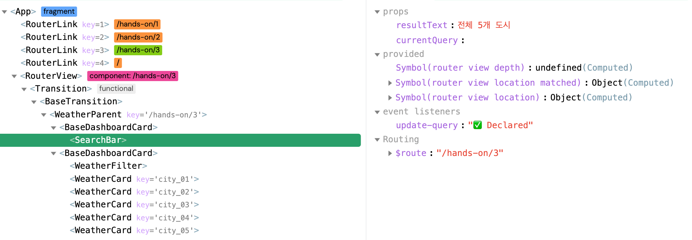

# Hands-on 3 - Component

## 기본 요구사항

### 1. `WeatherParent.vue`

부모 컴포넌트가 전체 상태를 관리하는 방식을 배우고 날씨 배열, 검색어, 선택한 도시, 날씨 필터와 관련된 반응형 로직을 `WeatherParent`에 유지했습니다.

### 2. `BaseDashboardCard.vue`

공통 UI를 재사용하기 위해 검색 영역과 날씨 목록 영역의 배경, 테두리, 여백을 `BaseDashboardCard`로 분리했습니다. 내부에는 `slot`을 배치해 부모가 서로 다른 내용을 넣을 수 있게 했습니다.

### 3. `SearchBar.vue`

`props`와 `emits`를 적용해 부모의 검색어와 결과 문구를 전달받아 표시했습니다. 입력값이 변경되면 `update-query` 이벤트로 새로운 검색어를 부모에게 전달했습니다.

### 4. `WeatherCard.vue`

도시 객체를 `props`로 전달받아 카드에 표시했습니다. 카드 선택은 `select-card`, 상세보기는 `click-detail` 이벤트로 부모에게 전달했습니다.

### 5. 컴포넌트별 스타일 분리

각 컴포넌트가 직접 렌더링하는 요소의 디자인은 해당 파일의 `<style scoped>`로 분리했습니다. 여러 화면에서 함께 사용하는 색상과 기준은 공통 CSS에 두었습니다.

### 6. Slot을 통한 컴포넌트 배치

`SearchBar`와 `WeatherCard`를 `BaseDashboardCard`의 `slot` 안에 배치했습니다. 화면에서는 공통 카드 내부에 보이지만 데이터와 이벤트는 `WeatherParent`에서 직접 연결했습니다.

### 7. 본인만의 추가 컴포넌트

Composition 실습에서 만든 날씨 상태 필터를 `WeatherFilter` 컴포넌트로 추가 분리했습니다. 선택값은 `props`로 받고 변경값은 `select-weather` 이벤트로 부모에게 전달했습니다.

## 구현 화면

### 컴포넌트 분리 화면

`WeatherParent` 안에서 검색창, 날씨 필터, 날씨 카드가 각각의 컴포넌트로 표시되는 화면입니다.

### 컴포넌트 구조 확인 화면

Vue DevTools에서 `WeatherParent`와 하위 컴포넌트의 구조를 확인하는 화면입니다.

### Props와 Emits 확인 화면

`SearchBar` 또는 `WeatherCard`가 전달받은 props와 부모로 전달하는 이벤트를 확인하는 화면입니다.

## 개인 추가 사항

### 1. `WeatherFilter` 컴포넌트 분리

부모 템플릿이 복잡해지지 않도록 날씨 선택 버튼을 별도 컴포넌트로 분리하고 `props`와 `emits` 흐름을 동일하게 적용했습니다.

### 2. 검색 결과 문구 역할 분리

검색 결과 계산은 데이터가 있는 부모가 담당하고 `SearchBar`는 전달받은 문구를 표시만 하도록 나눠 각 컴포넌트의 역할을 분명하게 했습니다.
