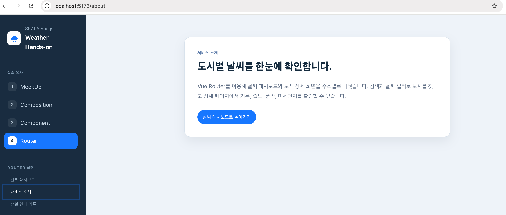
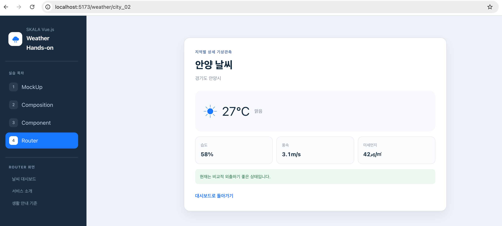
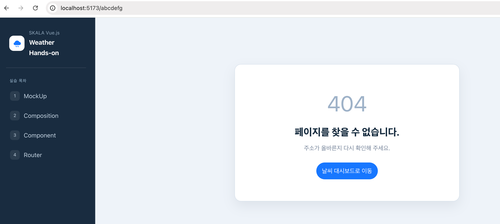

# Hands-on 4 - Router

## 기본 요구사항

### 1. Vue Router 설정

`router/index.js`에 URL과 화면 컴포넌트의 연결 규칙을 작성했습니다. 각 화면은 동적 `import`로 지연 로딩하고, 등록되지 않은 주소는 Catch-all Route를 통해 `NotFoundView`로 연결했습니다.

### 2. `App.vue`에 Navigation Bar와 `RouterView` 배치

`RouterLink`로 화면 이동 메뉴를 만들고, 현재 URL에 해당하는 화면이 표시되도록 메인 영역에 `RouterView`를 배치했습니다.

### 3. `WeatherHomeView.vue`

`WeatherParent`의 기능과 기존 하위 컴포넌트를 재사용해 `/` 경로의 메인 화면을 만들었습니다. 상세보기 버튼은 알림창 대신 `router.push`로 도시 ID가 포함된 상세 경로로 이동하도록 변경했습니다.

### 4. `WeatherDetailView.vue`

`/weather/:cityId` 동적 경로에서 `cityId`를 전달받았습니다. 컴포넌트가 마운트될 때 Mock Data에서 ID가 일치하는 도시를 찾아 상세 기상 정보를 표시했습니다.

### 5. `WeatherAboutView.vue`

서비스 소개 내용을 별도 화면으로 작성하고 `RouterLink`를 사용해 메인 날씨 대시보드로 돌아갈 수 있게 했습니다.

### 6. 추가 View 작성 및 Routing

생활 안내 기준을 보여주는 `WeatherGuideView`를 만들고 `/guide` 경로와 이동 메뉴를 추가했습니다.

## 구현 화면

### 서비스 소개 화면

`/about` 경로에서 서비스 소개 화면이 표시되는 것을 확인한 화면입니다.

### 동적 상세 경로 화면

주소의 `cityId`에 맞는 도시 상세 날씨가 `WeatherDetailView`에 표시되는 화면입니다.

### 등록되지 않은 경로 화면

등록되지 않은 주소로 접근했을 때 `NotFoundView`가 표시되는 화면입니다.

## 개인 추가 사항

### 1. 이전 Hands-on 경로 연결

각 실습 결과를 한 프로젝트에서 비교할 수 있도록 MockUp, Composition, Component 화면도 각각의 경로로 연결했습니다.

### 2. 생활 안내 기준 화면

날씨 카드의 안내 문구가 어떤 조건에서 표시되는지 따로 확인할 수 있도록 `WeatherGuideView`를 추가했습니다.

### 3. Router 세부 메뉴와 화면 전환

Router 실습 화면을 쉽게 이동할 수 있도록 세부 메뉴를 추가했습니다. 화면이 갑자기 바뀌지 않도록 `RouterView`에 짧은 전환 효과도 적용했습니다.
