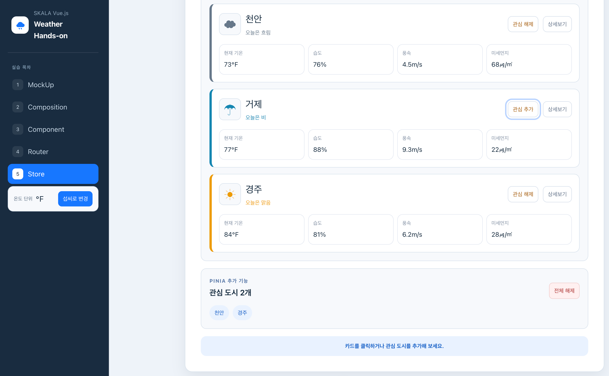

# Hands-on 5 - Store

## 기본 요구사항

### 1. `UnitToggler.vue`

Pinia의 `configStore`에서 단위 상태를 가져와 현재 단위를 표시했습니다. 버튼을 누르면 `toggleUnit` action이 실행되어 섭씨와 화씨가 변경되도록 했습니다.

### 2. Navigation Bar 옆에 `UnitToggler.vue` 배치

Hands-on 5 화면에 들어왔을 때 Navigation Bar 안에 `UnitToggler`가 표시되도록 연결했습니다. 대시보드 상단에도 같은 컴포넌트를 배치해 두 위치가 같은 Store 상태를 공유하도록 했습니다.

### 3. 메인과 상세 날씨에 단위 설정 적용

메인과 상세 화면에서 `configStore.unit`을 확인해 섭씨를 화씨로 변환했습니다. 단위를 변경하면 두 화면의 기온과 단위 기호가 함께 변경됩니다.

### 4. 본인만의 추가 Store

config에 추가하지 않고 관심 도시를 관리하는 `favoriteStore`를 새로 만들었습니다. 관심 도시 ID는 state, 관심 도시 개수는 getter, 추가, 해제와 전체 해제는 action으로 작성했습니다.
구조는 관심 도시를 설정하는 WeatherStoreCard.vue 파일, 관심도시 목록과 개수를 표시하는 WeatherStoreHome.vue 파일, 상세 화면 내부의 WeatherStoreDetail.vue 가 같은 Store을 바라보도록 했습니다.

배열로 하여 도시 객체 전체가 아닌 ID만 저장하는 구조로 만들었습니다.

## 구현 화면

### Store 기능 구현 화면

대시보드에서 온도 단위 변경과 관심 도시 추가 결과를 한 화면에서 확인할 수 있습니다.

## 개인 추가 사항

### 1. 관심 도시 관리

자주 확인하는 도시를 간단히 구분할 수 있도록 관심 도시 추가, 해제 기능을 만들었습니다. Pinia의 state, getter, action을 한 기능에서 모두 연습하기 위해 추가했습니다.
