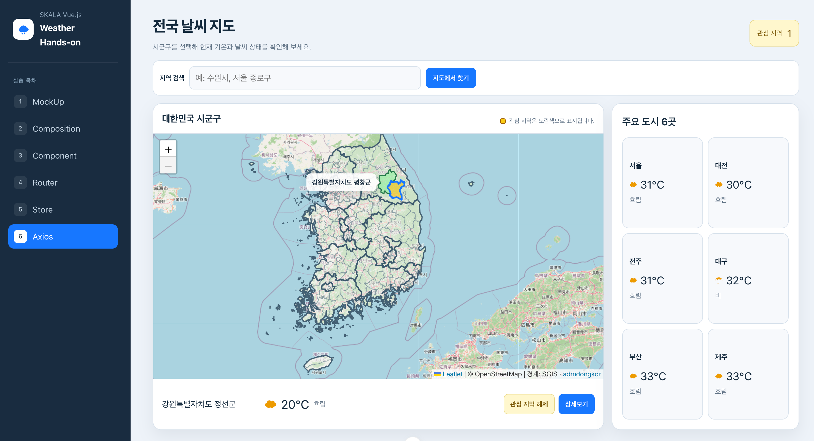
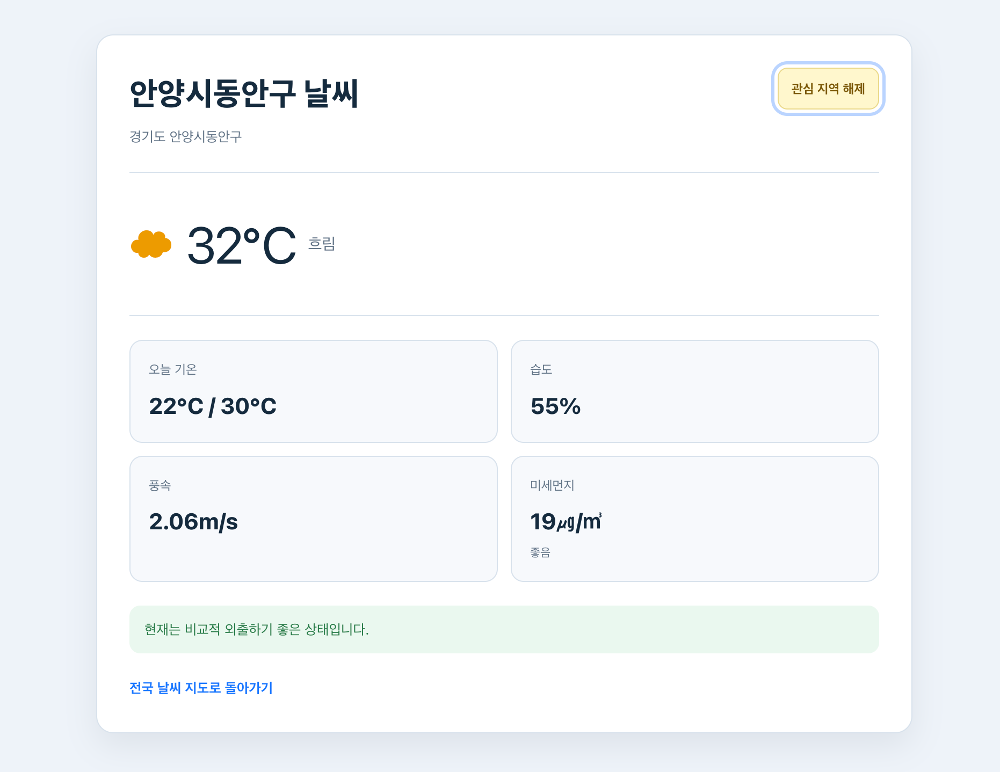

# Hands-on 6 - Axios

## 기본 요구사항

### 1. OpenWeatherMap API를 통한 실제 날씨 데이터 적용

Axios의 `get` 요청으로 선택한 시군구와 주요 도시 6곳의 현재 날씨를 가져왔습니다. 응답 데이터에서 현재 기온과 날씨 상태를 선택해 메인 화면에 표시했습니다.

### 2. OpenWeatherMap 추가 API 활용

OpenWeatherMap의 Air Pollution API를 추가로 호출했습니다. 상세 화면에서 현재 날씨의 습도와 풍속을 함께 보여주고, Air Pollution API의 미세먼지 수치를 표시했습니다.

### 3. 기타 외부 API 활용

선택한 지역의 중심 좌표를 Open-Meteo Forecast API에 전달했습니다. 응답받은 오늘의 최저/최고 기온을 상세 화면에 추가했습니다.

## 구현 화면

### 전국 날씨 지도 화면

### 지역 상세 날씨 화면

## 개인 추가 사항

### 1. 전국 시군구 지도

Leaflet과 행정구역 경계 데이터를 활용해 전국 시군구를 지도에서 선택할 수 있게 했습니다. 도시 목록만 사용하는 것보다 원하는 지역을 직접 찾기 쉽게 만들기 위해 추가했습니다.

### 2. 관심 지역 표시

Pinia Store에 관심 지역 코드를 저장하고 해당 지역을 지도에서 노란색으로 표시했습니다. 자주 확인하는 지역을 구분할 수 있도록 추가했습니다.

### 3. 지역 검색과 주요 도시 목록

지역명 검색으로 해당 시군구로 이동하는 기능과 주요 도시 6곳의 날씨 목록을 만들었습니다. 지도에서 지역을 찾기 어려운 경우에도 빠르게 날씨를 확인할 수 있도록 추가했습니다.
