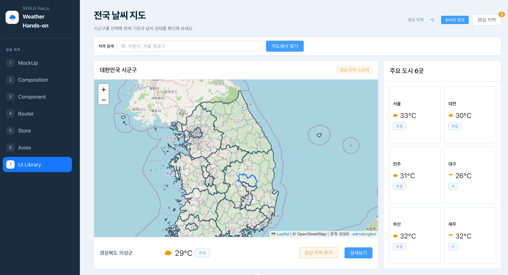
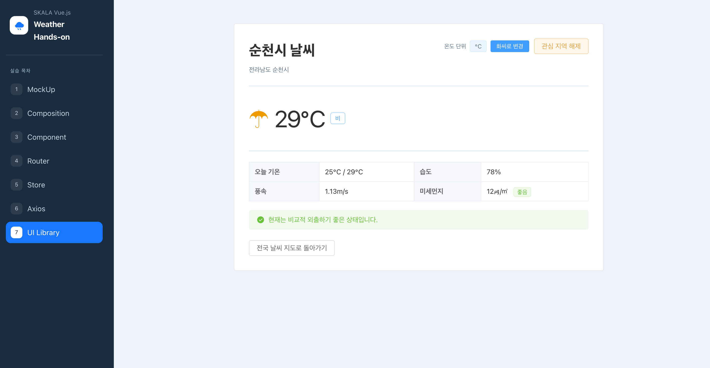

# Hands-on 7 - UI Library

## 기본 요구사항

### 1. OpenWeatherMap API를 통한 실제 날씨 데이터 적용

Hands-on 6의 Axios 요청을 유지해 시군구와 주요 도시 6곳의 실제 기온과 날씨 상태를 표시했습니다.

### 2. OpenWeatherMap 추가 API 활용

Air Pollution API로 미세먼지를 가져오고, 현재 날씨 API의 습도와 풍속을 상세 화면에 표시했습니다.

### 3. 기타 외부 API 활용

Open-Meteo API로 오늘의 최저·최고 기온을 가져오고 상세 날씨 정보에 추가했습니다.

### 4. 외부 UI Library 적용

Element Plus를 설치하고 기존 화면의 입력창, 버튼, 카드, 상태 표시와 상세 정보 영역을 UI 컴포넌트로 변경했습니다.

## 구현 화면

### Element Plus를 적용한 전국 날씨 지도

### Element Plus를 적용한 상세 날씨 화면

## 개인 추가 사항

### 1. 로딩 및 오류 상태 표시

`ElSkeleton`과 `ElAlert`를 사용해 API 요청 중인 상태와 오류 메시지를 화면에서 구분할 수 있게 했습니다.

### 2. 날씨 정보 구분

`ElTag`와 `ElDescriptions`를 사용해 날씨 상태와 상세 수치를 구분해서 표시했습니다.

### 3. 온도 단위 UI 변경

기존 Pinia의 섭씨·화씨 상태를 그대로 사용하고, 단위 표시와 변경 버튼만 Element Plus 컴포넌트로 바꿨습니다.
