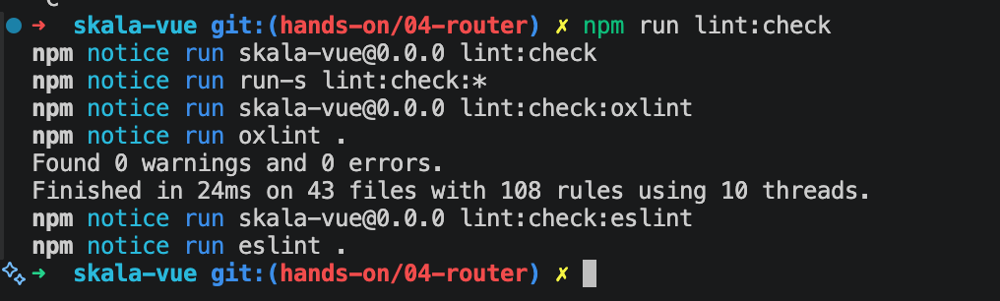
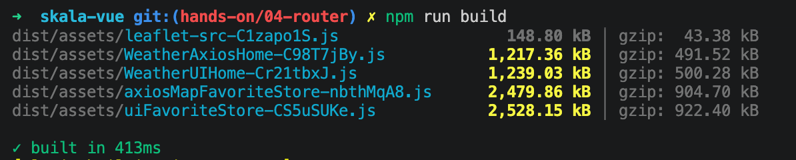
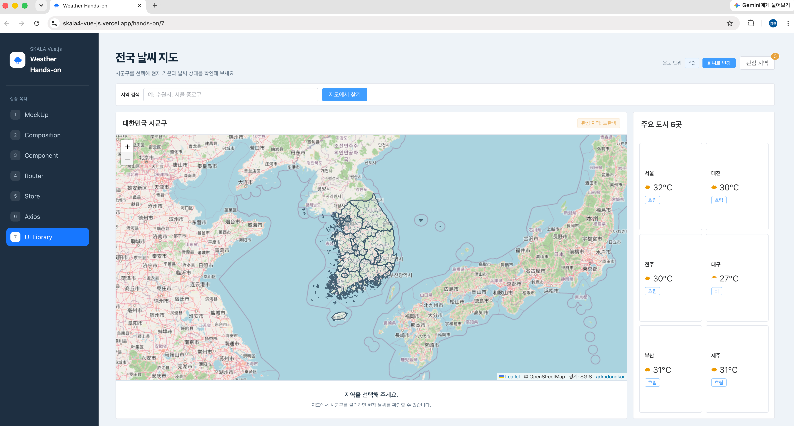

# Hands-on 8 - Deployment

## 제출 링크

- GitHub: [skala4_vue.js](https://github.com/uemy6unoh/skala4_vue.js)
- Vercel: 배포 후 주소 입력

## 기본 요구사항

### 1. ESLint 점검

`npm run lint:check` 명령으로 제출할 소스 코드를 검사하고 오류가 없는지 확인했습니다.


### 2. API 키 환경 변수 관리

OpenWeatherMap API 키는 `.env.local`에 저장하고 Git에 올라가지 않도록 설정했습니다. 저장소에는 변수 이름만 적은 `.env.example`을 추가했습니다.

### 3. 프로젝트 Build

`npm run build` 명령으로 프로젝트를 빌드하고 `dist` 폴더가 생성되는 것을 확인했습니다.

### 4. 정적 파일 Hosting

빌드된 최종 결과를 배포 서비스에 올리고 실제 주소에서 날씨 지도와 상세 화면이 동작하는지 확인합니다.

## 점검 명령

```bash
npm install
npm run lint:check
npm run build
npm run preview
```

## 구현 화면

### ESLint 검사 결과



### Build 결과




### 배포된 화면

<!--  -->

배포 주소와 전국 날씨 지도가 함께 보이도록 브라우저 화면을 촬영합니다.

## 개인 추가 사항

### 1. 검사 전용 명령 추가

기존 파일을 자동 수정하지 않고 오류만 확인할 수 있도록 `lint:check` 명령을 추가했습니다.

### 2. 환경 변수 예시 파일 추가

API 키 값은 공개하지 않으면서 필요한 변수 이름을 알 수 있도록 `.env.example`을 작성했습니다.
